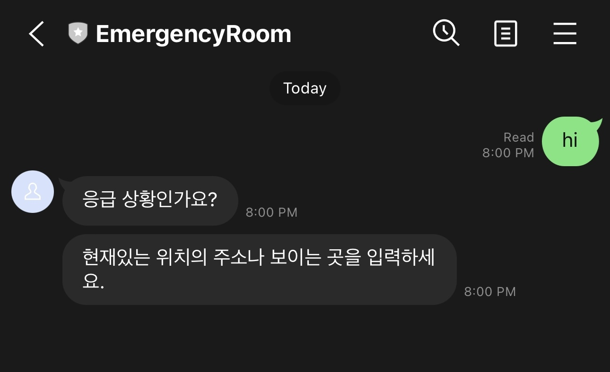
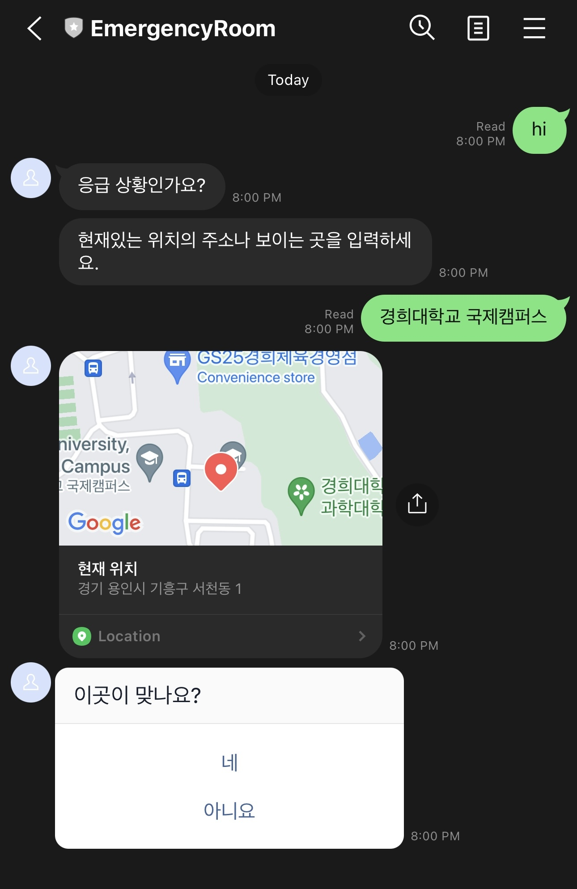

<br></br><br></br>
<p align="center"> </p>

# EmergencyRoom-ChatBot


[](https://www.javascript.com) [](https://www.javascript.com) [](https://www.javascript.com)

[](https://developers.line.biz/en/docs/messaging-api/overview/) [](https://developers.kakao.com/docs/latest/ko/local/common) [](https://api.ncloud-docs.com/docs/ai-naver-mapsdirections-driving) [](https://www.data.go.kr/data/15057684/openapi.do)


EmergencyRoom-ChatBot is a chatbot service delivered on line-messenger platform.

## For End Users

#### Getting Started
 * Add the ChatBot's LINE channel to your friends' list
You can start by adding out channel at https://liff.line.me/1645278921-kWRPP32q/?accountId=330zpmoc .


#### Find Emergency Room near you
1. send any message to activate the EmergencyRoom-ChatBot.




2. send your current location


-


## For Developers
### Installation

#### Requirements
This project was built on ```Amazon Linux 2``` on ```ec2``` instance of aws. 
Following instructions will be compatible on ```Amazon Linux 2``` and other linux distributions. 

#### Install From Source
```bash
git clone git@github.com:curieyoon/emergencyRoom-ChatBot.git
cd emergencyRoom-ChatBot
npm install --save
npm install -g yarn
yarn add dotenv
```

#### Add your private keys
Under the root repository ```emergencyRoom-ChatBot```, create your ```.env``` file containing private keys for the APIs this project depends on. 
Your ```.env``` file should look like this:
```bash
CHANNEL_ACCESS_TOKEN="Your_Line_Messenger_Access_Token"
KAKAO_KEY="KakaoAK Your_Kakao_API_Private_Key"
MY_DOMAIN="Your_server_domain_which_this_service_runs_on"
EMERGENCY_KEY="Your_Hospital_API_Key"
DIR_ID = "Your_Naver_Map_API_ID"
DIR_KEY = "Your_Naver_Map_API_KEY"
```

To import ```.env``` file properly in each module, make sure the line ```require("dotenv").config( {path: "/path/to/.env"} );``` contains the absolute path of your ```.env``` file on your server.

 * ```CHANNEL_ACCESS_TOCKEN```: 
 * ```KAKAO_KEY```:
 * ```MY_DOMAIN```:
 * ```EMERGENCY_KEY```:
 * ```DIR_ID``` :
 * ```DIR_KEY```:

