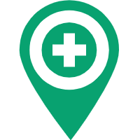

<br></br>
<p align="center"> </p>

# <p align="center">EmergencyRoom-ChatBot</p>
<p align="center">
</p>
<p align="center">
 <a  href='https://www.javascript.com'> </a><a  href='https://www.javascript.com'> </a></p>
<p align="center">
 <a href='https://developers.line.biz/en/docs/messaging-api/overview/'> </a> <a href='https://developers.kakao.com/docs/latest/ko/local/commo'></a> <a href='https://api.ncloud-docs.com/docs/ai-naver-mapsdirections-driving'>   </a> <a href='https://www.data.go.kr/data/15057684/openapi.do'> </a>


</p>

## Overview

Searching for available emergency room in a straightforward manner is a multi-step process which includes 1) searching for nearby hospitals that may have any ER 2) confirming the ER availability via phone calls or websites, etc. until you find one that accommodates to your need. (if there's any)<br />EmergencyRoom Chatbot provides you with a much more efficient and faster solution; drop your address and the Chatbot will have rest of the work done for you on the fly. 


## For End Users

#### Getting Started
 * Add the ChatBot's LINE channel to your friends' list
You can start by adding out channel at https://liff.line.me/1645278921-kWRPP32q/?accountId=330zpmoc .<br />


#### Find Emergency Room near you
1. send any message to activate the EmergencyRoom-ChatBot.


2. enter your current address (e.g 서천동, 덕영대로) or name of the place near you (e.g 경희대학교)


3. confirm your location by tapping '네'
<br />

4. ChatBot will then check ER availability of nearby hospitals. If there's any, it will send the list of the hospitals in ascending order of estimated time to get there from your current location.
    <br />Note that the hospitals are sorted by estimated time instead of absolute distance from your location, which adds even more reliability for your urgency. <br />

## For Developers
### Installation

#### Requirements
This project was built on ```Amazon Linux 2``` on ```ec2``` instance of aws. 
Following instructions will be compatible on ```Amazon Linux 2``` and other linux distributions. 

#### Install From Source
```bash
git clone git@github.com:curieyoon/emergencyRoom-ChatBot.git
cd emergencyRoom-ChatBot
npm install --save
npm install -g yarn
yarn add dotenv
```

#### Add your private keys
Under the root repository ```emergencyRoom-ChatBot```, create your ```.env``` file containing private keys for the APIs this project depends on. 
Your ```.env``` file should look like this:
```bash
CHANNEL_ACCESS_TOKEN="Your_Line_Messenger_Access_Token"
KAKAO_KEY="KakaoAK Your_Kakao_API_Private_Key"
MY_DOMAIN="Your_server_domain_which_this_service_runs_on"
EMERGENCY_KEY="Your_Hospital_API_Key"
DIR_ID = "Your_Naver_Map_API_ID"
DIR_KEY = "Your_Naver_Map_API_KEY"
```

To import ```.env``` file properly in each module, make sure the line ```require("dotenv").config( {path: "/path/to/.env"} );``` contains the absolute path of your ```.env``` file on your server.

Each key in the ```.env``` indicates:
 * ```CHANNEL_ACCESS_TOCKEN```: 
 * ```KAKAO_KEY```:
 * ```MY_DOMAIN```:
 * ```EMERGENCY_KEY```:
 * ```DIR_ID``` :
 * ```DIR_KEY```:

